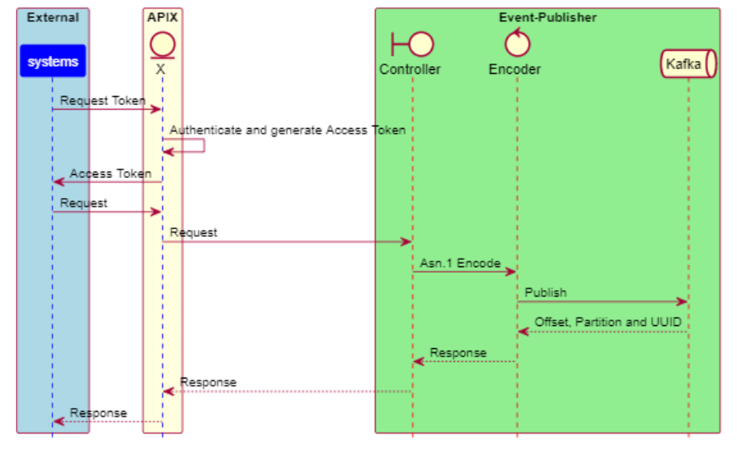
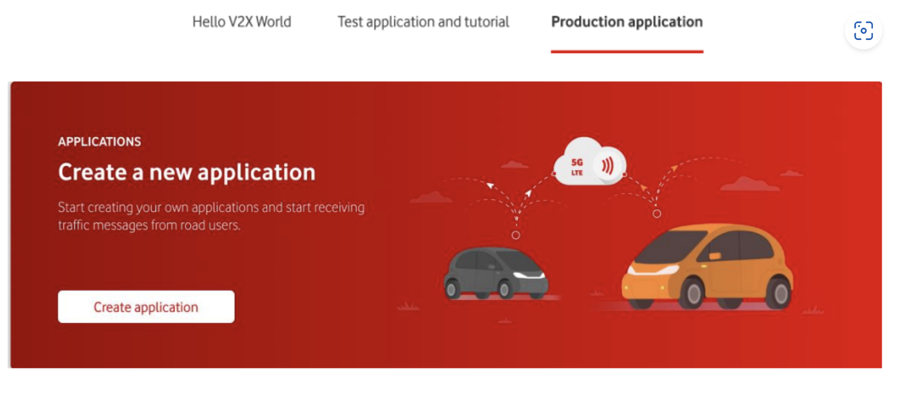
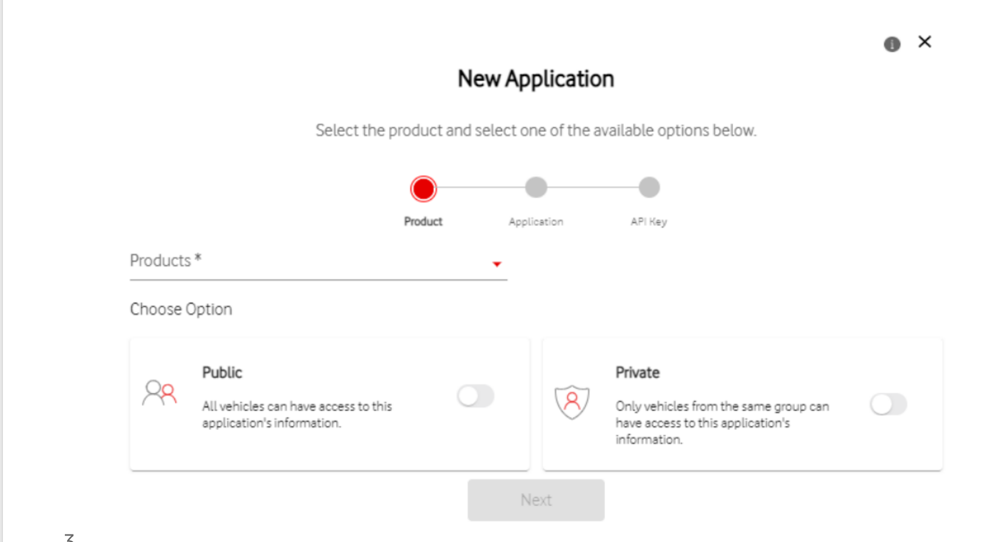
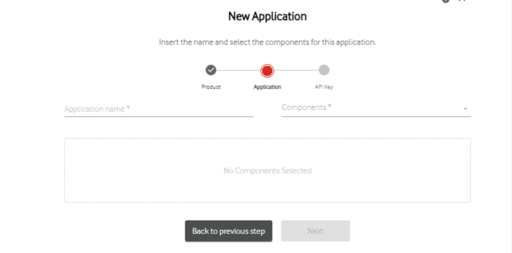
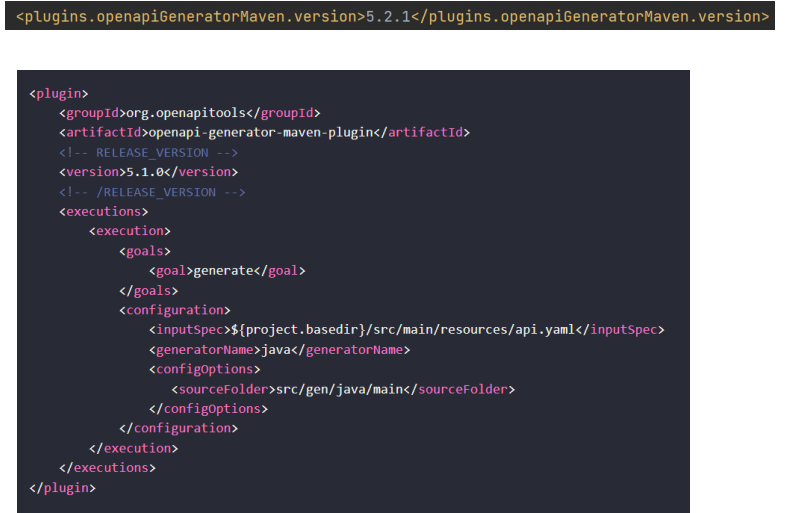
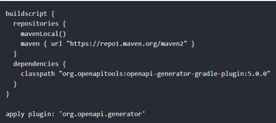

# HelloV2XHTTPS-Publisher

The V2X Event-Publisher Service offers a managed solution allowing partners to communicate with your STEP Platform, and to publish ETSI messages in STEP. 




## Overview

HelloV2XHTTPS-Publisher is an example project on how to publish ETSI messages in STEP through V2X Event-Publisher API, it provides an example for constructing CAM and DENM messages and publishing it in STEP through V2X Event-Publisher API. The endpoint exposed, and the messages types supported by STEP models are defined in the openapi.yaml file.Also, it provides an example on how to generate APIX token for calling V2X Event-Publisher API.


##### Onboarding


Customers must first register with V2X Portal as an API users to enable their accounts to use V2X Event-Publisher API [register here](https://de-he.step.vodafone.com). Part of the onboarding will consist of the generation and supply to the customer of an API Key (client id and client secret), enabling the use of APIX Authorisation API.

The client id is considered to be the first substring of the API Key generated on the portal for your app, and the client secret is the second part.

xxxxxxxxx:yyyyyyyyy

The onboarding steps can be found [here](https://de-he.step.vodafone.com/portal/products/onboarding/SAFETY-V2X)


##### Authentication & Authorization

Users must be authorized and authenticated to use the  V2X Event-Publisher API. This requires prior 
enablement of the REST APIs, and grant of an OAuth2 Client Credentials token from APIX OAuth2 API 
with the appropriate scopes.
Credentials for the OAuth2 token can be generated from V2X Portal during the Onboarding process.


##### OAuth2 Acess Token

APIs use OAuth 2.0 for authentication and authorization. To make an API request, a Customer Application 
must first obtain a valid OAuth2 token from the OAuth2 Authorization API. 
This token must be passed in a header to all other V2X resource requests:

```
Header = Authorization: Bearer <OAuth2 token value>
```

APIX Vodafone OAuth2 tokens from the OAuth2 Authorization API have been configured with a lifetime 
of 60 minutes (3600 seconds). Vodafone has implemented the RFC6749 OAuth2 Standard to refresh 
tokens and increase their lifetime and applications need to re-request OAuth2 tokens when they have 
expired.
User interaction is not required in any of the OAuth2 workflows. 

##### Scope

API access is limited by scope. The scope must be passed in the request when obtaining an OAuth2 
Token to use any resources of APIs listed in this guide. The following Scopes must be associated with eh 
API Key used in the Authentication process:
* EVENT_PUBLISHER_ALL;
* OAUTH2_CLIENT_CREDENTIALS_GRANT


# Getting Started

To start publish/consume ETSI messages it is required to have STEP platform V2X ETSI application with API access:

1- Register on STEP Portal [here](https://de-he.step.vodafone.com).

2- Log into STEP [here](https://de-he.step.vodafone.com).

3- Create V2X application:



* Choose the Safety V2X product in the product tab.


* Choose "API" component in the Application tab.




4- Application will be created with pending status until it gets approved by STEP, and you will receive an email with your API key. This key is placed in the application.yaml to publish messages to STEP


## Prerequisits

1. Customer Registered to STEP [here](https://de-he.step.vodafone.com).

2. Customer Logged to STEP [here](https://de-he.step.vodafone.com).

3. Safety V2X API application is created following the steps in the [onboarding documentation](https://de-he.step.vodafone.com/portal/products/onboarding/SAFETY-V2X).

4. Application is approved by STEP and API key is provided.


Note: 
* In this sample project Scope, clientId and clientSecret are defined in the application.yaml
* The API exposed can be customized in the openapi.yaml


## Technology

This project is implemented using:
* Java
* OpenApi Specification
* SpringBoot Framework


## How To Run: 

* Clone this repository.
* Replace the clientId and the clientSecret with your API key in the application.yaml file to generate the oAuth token. 
* Startup server. (port can be changed  in the application.yaml)


* Generate the jave classes using maven plugin, add the following plugin to the build section of the pom file, and set the path to the `openapi.yaml` in the ``<inputSpec>`` property.

````
<plugin>
				<groupId>org.openapitools</groupId>
				<artifactId>openapi-generator-maven-plugin</artifactId>
				<version>5.3.0</version>
				<executions>
					<execution>
						<goals>
							<goal>generate</goal>
						</goals>
						<configuration>
							<inputSpec>
								${project.basedir}/src/main/resources/openapi.yaml
							</inputSpec>
							<output>${project.basedir}</output>
							<generatorName>spring</generatorName>
							<apiPackage>${project.groupId}.api</apiPackage>
							<modelPackage>${project.groupId}.model</modelPackage>
							<supportingFilesToGenerate>
								ApiUtil.java
							</supportingFilesToGenerate>
							<configOptions>
								<delegatePattern>true</delegatePattern>
							</configOptions>
						</configuration>
					</execution>
				</executions>
			</plugin>
````

then 


* mvn clean install


# Additional Information
## STEP Publisher API
Find detailed information about STEP Publisher API [here](https://de-he.step.vodafone.com/portal/products/api/publisher/SAFETY-V2X).

# Development
Start with generating the java classes,using the OpenApi specification.
 
#####  Using integrated build tool plugins

##### 1. Using Maven Plugin

* To generate the .java files using the maven plugin you need to add in your pom file, the following 
plugin configuration as shown below.



* Afterwards, to generate the Java classes, you will need to run:
   
   mvn clean compile
   

##### 2. Using Gradle
* To use Gradle instead of maven, you will need to include the following configuration:

 


  


